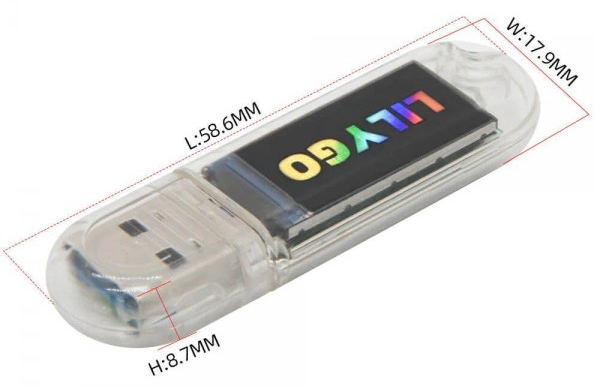
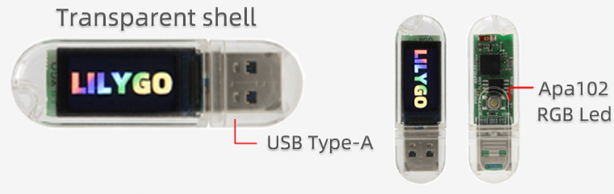
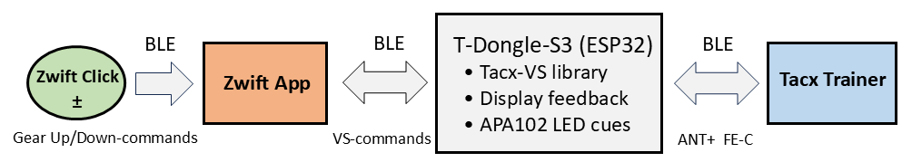
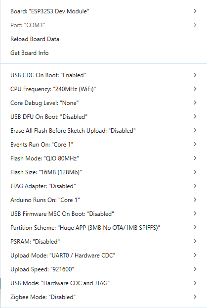
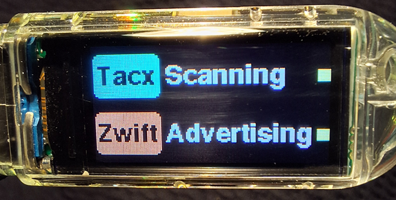

# 🌀 Tacx-Dongle-VS
**Virtual Shifting (VS) for older Tacx Smart trainers using the LilyGo T-Dongle-S3 and the [Tacx-Virtual-Shifting](https://github.com/Berg0162/Tacx-Virtual-Shifting) library.**

---

## 🏁 Overview
  

**Tacx-Dongle-VS** is a self-contained dongle that bridges **Zwift’s Virtual Shifting** system with **older Tacx Smart trainers** that never received Garmin’s 2025 firmware update.  
It combines a modern **ESP32-S3 microcontroller**, a **built-in ST7735 IPS display**, a **status LED** and when the project code is uploaded, it delivers **plug-and-ride compatibility**.
 

---

## ⚙️ What is Virtual Shifting (VS)?
Virtual Shifting lets you *change gears digitally* while riding indoors and using the **Zwift Click device**.
Instead of mechanical chain movements, Zwift adjusts resistance and power targets in software, simulating gear ratios.  
Recent Tacx trainers implement this natively; older ones cannot — unless a small bridge device translates between Zwift’s BLE protocol and Tacx’s ANT+ FE-C control channel.

---

## 🔗 What is the Tacx-Virtual-Shifting library?
The [Tacx-Virtual-Shifting](https://github.com/Berg0162/Tacx-Virtual-Shifting) Arduino library:

- connects to **Zwift** via BLE (as a Smart Trainer peripheral)  
- connects to a **Tacx trainer** via ANT+ FE-C  
- interprets Zwift’s *virtual-gear*, *target-power*, or *gradient* messages  
- sends equivalent ANT+ commands to the older Tacx trainer  

The **Tacx-Dongle-VS** project wraps this library into a ready-to-use hardware package — the LilyGo T-Dongle-S3.

---

## 💡 Why the T-Dongle-S3?
- **ESP32-S3** – dual-core MCU with native BLE and plenty of flash/RAM  
- **Integrated display** – 0.96″ ST7735 IPS panel for connection & error feedback  
- **APA102 LED** – multicolor indicator for connection status  
- **USB-C** – single-cable power + firmware updates  

**These make the smallest and most affordable all-in-one bridge for Tacx VS.**

 

For pricing see for example: [TinyTronics](https://www.tinytronics.nl/en/development-boards/microcontroller-boards/with-wi-fi/lilygo-t-dongle-s3-esp32-s3)

---

## 🔄 How it Works Together

 

The dongle receives Zwift VS events via BLE, translates them using the Tacx-Virtual-Shifting library, and re-emits trainer-compatible ANT+ commands — effectively adding VS to older hardware.

---

## 🧩 Dependencies
| Library | Purpose | Source |
|----------|----------|---------|
| **Tacx-Virtual-Shifting** | BLE ↔ ANT+ bridge core | [GitHub Repo](https://github.com/Berg0162/Tacx-Virtual-Shifting) |
| **Arduino-GFX** | ST7735 display driver | Arduino Library Manager |
| **Adafruit_DotStar** | APA102 LED control | Arduino Library Manager |

---

## 🚀 Getting Started

1. **Clone** or download this repository.  
2. Unzip this code to your Arduino **sketch folder**.  
3. Install **all required libraries** (see [Dependencies](#-dependencies)).  
4. Select **Board → ESP32S3 Dev Module**.  
5. Set all options in **`Tools → Menu`** as shown below:  

     

6. Connect the dongle via **USB-C**.  
7. Open the main `.ino` sketch and **upload**.  
8. On boot you’ll see:  
   - a **splash screen**,  
   - Tacx and Zwift connection rows with text + color cues,  
   - the **APA102 LED** mirroring the same connection states.  

When both devices show *Connected* (🟢 green), you’re ready to ride!

---

## 🧠 Color Feedback Legend
| Color | Meaning |
|:------|:---------|
| 🟡 Yellow | Scanning & Advertising |
| 🟢 Green | Connected |
| 🔴 Red | Connection Lost |
| 🔵 Led only | Scanning for Tacx |
| 🟠 Led only | Advertising for Zwift |

---

## 🖼️ Screenshot

**Tacx-Dongle-VS** during **scanning** (for Tacx trainer) and simultaneously **advertising** (for notifying Zwift app), device status Led is **yellow blinking**! 

 

---

## 🧾 License
This project is licensed under the **GNU General Public License v3.0 (GPL-3.0)**.  
You may freely use, modify, and distribute this project, provided that any derivative work is also licensed under GPL-3.0.

---

## ✍️ Future Ideas
- OTA (Wi-Fi) firmware updates  
- OLED or e-paper variant for low-power builds  
- Optional web-UI configuration  

---

> © 2025 Tacx-Dongle-VS Project • Developed with ❤️ by the community  
>  
> For questions or contributions, open a [GitHub issue](../../issues) or start a discussion thread.

