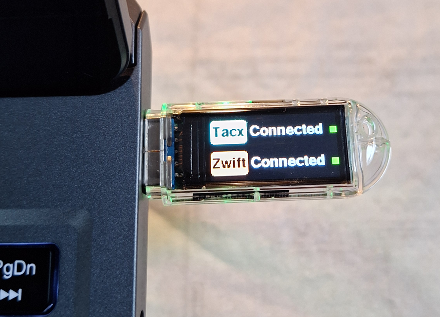
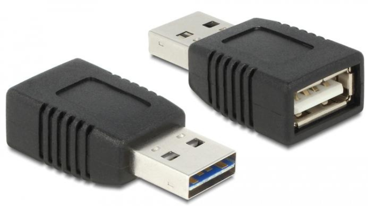
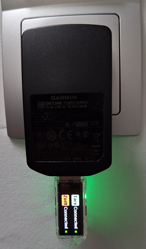

# 🔧Troubleshooting

---

## 🧩 What’s happening when connecting **Tacx-Dongle-VS** to an USB-A Port that belongs to the laptop/computer running Zwift?
  
When the **T-Dongle-S3** is powered from a computer’s USB port, the operating system (Windows, macOS, or Linux) automatically tries to enumerate the connected USB device — that means it checks what kind of device it is (Serial, HID, Mass Storage, etc.) and may assign a COM port. Sofar no problems! The Tacx-Dongle-VS boots, runs the code, and even is connecting to a tacx trainer.... 

However, when Zwift starts and reaches its **pairing screen**, the app (and its helper processes) aggressively scan for trainer interfaces — both *wireless* (BLE) and *wired* (USB).
 

Specifically:

- Zwift’s pairing module historically looks for **all USB HID and serial devices** that identify as:

	- The original **Tacx i-Magic / Bushido USB trainers**,

	- **Wahoo KICKR** via **USB HID dongles**,

	- and **ANT+ dongles** that show up as USB CDC devices.
	
- It also resets and queries each connected USB-A device to check its **Vendor ID / Product ID / Interface descriptors**.

This process causes **momentary USB bus resets** on some ports — particularly:

- On Windows and macOS laptops where Zwift runs in full control,

- On ports connected to the main root hub (shared power domain).

So when Zwift probes the USB bus, that probe cycle triggers a device re-enumeration — effectively causing your ESP32-S3 to reset. That’s legacy behavior, not a bug. Todays practice is that **Tacx-Dongle-VS** is repeatedly reset and never runs the code properly, when you do not take any measures!

### 🔌 Why this doesn’t happen with an USB-A charger?

When powered from, a dedicated USB charger, a power bank, or a powered hub with no active data connection.

- There’s **no data connection**, only +5 V power.

- The ESP32-S3’s USB peripheral is idle.

- So it runs fully independently — stable and isolated.

When powered from the laptop/computer (with Zwift running):

- USB data lines (D+ / D–) are active.

- Zwift’s probe cycles cause **line resets** and **host-driven bus events** that make the ESP32-S3’s internal USB peripheral reboot.

### ✅ Workarounds

1. **Use an additional data-blocking USB adapter**

Use a **USB “charge-only” cable** or **data blocker** that passes only +5 V and GND, not D+ or D–.
This keeps your laptop as the power source but prevents Zwift resets.

> An USB-A charge-only adapter is a device that physically blocks data transmission, allowing it to safely charge devices like phones and tablets from public USB ports without the risk of data theft or malware from "juice jacking". It achieves this by disconnecting the data pins inside the USB connection, meaning the adapter **only transmits power**, not information.

  
These are inexpensive adapters often called “USB condom” or “data blocker”. Perfect for stable powering of ESP devices from a PC port.
 

2. **Power from isolated 5 V source**

  
Continue using a wall adapter (USB-A charger) or a small power bank if you want absolute stability.
 

---
 
## 🔮Compile this code with `ZWIFT_SAFE_MODE` defined

When `ZWIFT_SAFE_MODE` is defined in the code, the firmware configures the T-Dongle-S3’s USB interface
to use the **TinyUSB HID stack** instead of the default Arduino **Hardware CDC and JTAG** connection.
This makes the dongle appear to a computer as a harmless HID device rather than a serial port.

❗Recommended (**especially**) for use of an USB-A Port that belongs to the laptop/computer running Zwift.
Zwift will ignore the dongle, preventing the repeated USB resets that occur when it tries to probe serial devices.

⚠️ Uploads via Arduino IDE: not possible directly after flashing this mode.
To reprogram the dongle, [see next section.](https://github.com/Berg0162/Tacx-Dongle-VS/blob/main/docs/Troubleshooting.md#-safe-boot--reflashing-guide)

When the directive is **not** defined, the sketch builds in "normal" mode.
In this mode the USB interface remains a normal CDC serial device:

- Arduino IDE uploads and Serial Monitor work as usual.

- Zwift may repeatedly probe the dongle if connected to the same computer.

### 💡 Why this works

Zwift scans every USB device when pairing with trainers and ANT+ dongles.
Devices that identify as serial (CDC) or as known trainer brands (Tacx, Garmin, Wahoo, etc.) are queried repeatedly.
By switching the T-Dongle-S3 to the TinyUSB HID class, the dongle presents itself
as a generic **Human Interface Device** with an unrecognized vendor/product ID.
Zwift’s discovery logic quickly marks it as irrelevant and stops polling it.
As a result, the dongle remains stable and continues to bridge BLE data
without interference from Zwift’s USB scans.

### 🧩 What’s really going on

When you select **Hardware CDC and JTAG** in the `Tools → Menu`:

- The hardware USB block is owned by the Arduino core.

- It creates the CDC (Serial/COM) interface used for uploads and Serial Monitor.

When your code later calls the code section of `ZWIFT_SAFE_MODE` you are re-initializing that same hardware peripheral under the TinyUSB driver.
TinyUSB takes full ownership of the USB controller, replacing the **CDC and JTAG** setup that the bootloader used.

Result in Arduino IDE:

- The old CDC interface disappears → IDE loses the COM port.

- The device re-enumerates as a pure HID (or composite) but not as the upload target.

- From the IDE’s point of view the board “vanished”.

**That’s why you must press the BOOT button to re-enter the ROM bootloader before the next upload.**

---

## 🧰 Safe Boot & Reflashing Guide

If you’ve accidently or deliberately disabled the **Tacx-Dongle-VS**, you can **still upload new firmware** through the Arduino IDE at any time.
The ESP32-S3 includes a built-in USB bootloader that always runs before your sketch — so it’s impossible to “brick” the device through software.

### 🔄 Reflashing procedure

1. **Unplug** the dongle from power.

2. **Press and hold** the **BOOT** button (on the back side of the T-Dongle-S3).

3. **While holding BOOT**, plug in the dongle via USB-A to your computer with Arduino IDE.

4. **Release BOOT** once the IDE detects the COM port (it may appear as ESP32S3 Dev Module or similar).

5. **Select the correct board and port** in Arduino IDE.

6. **Upload** your new sketch normally.

7. When finished, the dongle will reboot into your new firmware.

>💡 **Note:** Even if your code disables USB CDC during runtime,
>the **ROM bootloader** always takes control first during upload —
>so you never lose the ability to flash new firmware.
